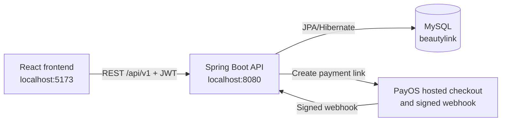

# BeautyLink


BeautyLink is a full-stack marketplace that connects customers with third-party beauty providers such as makeup artists, hair salons, nail studios, spas, massage centers, and skincare clinics.

> Project status: the main discovery, authentication, scheduling, booking, supplier, support, and PayOS checkout flows are functional. Real payment confirmation requires valid PayOS merchant credentials and a public HTTPS webhook URL.

## Latest application update (2026-10-03)

- Added a complete public supplier shop page inspired by marketplace storefronts. It includes the supplier banner and profile, verification and rating summaries, searchable/filterable services, customer reviews, store details, location map, sharing, and direct booking.
- Supplier names and discovery cards now open the corresponding shop, and each shop has a shareable `#shop/{supplierId}` route.
- Added database-backed service and supplier reviews from customer bookings. A paid, non-cancelled booking can hold one editable 0–5 star review for the service and one for the supplier.
- Expanded profile booking cards with service imagery, supplier identity and address, practitioner/time/price details, and a direct review action without opening the full appointment page.
- Added a dismissible discovery popup that lets guests and signed-in users choose Hà Nội or Thành phố Hồ Chí Minh and a service category before browsing.
- Added Vietnamese/English switching across the primary homepage, authentication, discovery, service, and booking flows.
- Added remember-login behavior, a compact partner-registration entry point, and a small logout confirmation toast.
- Reworked the header to give search more space, made categories more compact, and moved notifications to a floating bottom-right control without continuously generated deal alerts.
- Added browser location handling with a clearly labelled approximate network fallback when device GPS is unavailable. Suppliers can still enter exact store coordinates manually.
- Replaced the simulated QR checkout with a server-created PayOS hosted checkout. A booking is marked paid only after the backend verifies the signed PayOS webhook.
- Added client- and server-side Vietnamese validation messages for customer and admin forms, including authentication, profiles, bookings, reviews, reports, and admin report resolution.
- Improved cart dismissal, supplier registration/store forms, dashboard messaging, and responsive presentation throughout the updated flows.

PayOS credentials are read only by the backend. The frontend never receives merchant secrets and never treats a browser return URL as proof of payment; the signed PayOS webhook is the source of truth.

## Features

### Guest and customer

- Choose between Hà Nội and Thành phố Hồ Chí Minh.
- Browse database-backed service categories and providers.
- Search services, view prices, ratings, availability, and practitioners.
- Open a supplier shop to browse all of its services, reviews, address, and mapped location, then book without leaving the shop.
- Register or sign in with JWT authentication.
- Optionally remember the signed-in session on the current browser.
- Book an available appointment and view it in **Tổng quan & Lịch hẹn**.
- Allow location access to sort the **Gần bạn** section by device coordinates, with an explicitly labelled approximate network fallback on devices without GPS.
- Continue from booking details to the real PayOS hosted checkout.
- Cancel eligible appointments and submit support reports.
- Review the purchased service and its supplier directly from **Tổng quan & Lịch hẹn** after payment.

### Supplier

- Register a supplier business with store image, GPS coordinates, CCCD number, and front/back CCCD images. Local development auto-verifies it for demonstrations; production keeps it `PENDING` until approval.
- Access a supplier dashboard.
- Upload a store thumbnail and practitioner avatar images.
- Create, edit, publish, hide, and categorize store services.
- Manage practitioners and their weekly working hours, breaks, and slot duration.
- View appointments made with that supplier.
- See booking totals, upcoming work, completion rate, simulated order value, and status distribution on the dashboard.

### Staff and admin

- View customer reports.
- Move reports through open, in-review, resolved, or rejected states.
- Record resolution notes and the assigned staff member.

### Demo catalog

- Five categories: makeup, hair, spa, nails, and skincare.
- Demo suppliers and services for both supported cities.
- Demo suppliers are marked with `suppliers.demo_data = TRUE` for safe identification and later cleanup.
- Demo practitioners have working schedules, so the booking flow can be demonstrated end to end.

## Technology stack

| Layer | Technology |
|---|---|
| Frontend | React 19, TypeScript, Vite 6, Tailwind CSS 4 |
| Client state/API | React hooks, Axios, Zod, localStorage persistence |
| Backend | Java 21 LTS, Spring Boot 3.5, Spring Web |
| Authentication and payments | Spring Security, JWT, BCrypt, PayOS Java SDK |
| Persistence | Spring Data JPA, Hibernate |
| Database | MySQL 8 |
| Tests | JUnit 5, Spring MockMvc, H2 in MySQL compatibility mode |
| Deployment configuration | Vercel for `frontend`, Railway/Docker for `backend` |

## Architecture



During local development, Vite proxies `/api` requests to Spring Boot. In deployment, `VITE_API_BASE_URL` points the frontend to the public backend URL.

## Prerequisites

Install these before starting:

- Git
- Node.js 20.19 or newer and npm
- Java Development Kit 21
- Maven 3.9 or newer (`mvn` must be available in the terminal)
- MySQL Server 8

Check the installations:

```powershell
git --version
node --version
npm --version
java --version
mvn --version
mysql --version
```

## Local setup

### 1. Clone the repository

```powershell
git clone <YOUR_GITHUB_REPOSITORY_URL>
cd BeautyLink
```

### 2. Start MySQL

On Windows, the default service is commonly named `MySQL80`. Run PowerShell as Administrator:

```powershell
Start-Service MySQL80
```

If that service name does not exist, find the installed name:

```powershell
Get-Service *mysql*
```

On macOS with Homebrew:

```bash
brew services start mysql
```

On Linux with systemd:

```bash
sudo systemctl start mysql
```

### 3. Create the database

Open MySQL:

```powershell
mysql -u root -p
```

Then run:

```sql
CREATE DATABASE IF NOT EXISTS beautylink
  CHARACTER SET utf8mb4
  COLLATE utf8mb4_unicode_ci;
```

Exit with `exit;`.

Only the database itself must be created manually. Hibernate creates and updates the application tables when the backend starts.

### 4. Configure the backend

Copy the safe example file:

```powershell
Copy-Item backend/.env.properties.example backend/.env.properties
```

Open `backend/.env.properties` and enter local values:

```properties
MYSQL_JDBC_URL=jdbc:mysql://localhost:3306/beautylink?useSSL=false&allowPublicKeyRetrieval=true&serverTimezone=Asia/Bangkok&characterEncoding=UTF-8
MYSQL_USERNAME=your_mysql_username
MYSQL_PASSWORD=your_mysql_password
JWT_SECRET=replace-with-a-long-random-secret-of-at-least-32-characters
KYC_ENCRYPTION_KEY=replace-with-a-different-random-secret-of-at-least-32-characters
JWT_EXPIRATION_MS=86400000
CORS_ALLOWED_ORIGINS=http://localhost:5173,http://127.0.0.1:5173
SUPPLIER_AUTO_VERIFY=true
DEMO_DATA_ENABLED=true
DEMO_ACCOUNT_PASSWORD=Demo123!
PAYOS_CLIENT_ID=your_payos_client_id
PAYOS_API_KEY=your_payos_api_key
PAYOS_CHECKSUM_KEY=your_payos_checksum_key
PAYOS_RETURN_URL=http://localhost:5173/?payment=success
PAYOS_CANCEL_URL=http://localhost:5173/?payment=cancelled
```

`backend/.env.properties` is ignored by Git. Never commit this file or paste production secrets into source code.
`KYC_ENCRYPTION_KEY` protects supplier identity documents and must be different from `JWT_SECRET` in every deployment. Keep it stable when redeploying; changing or losing it makes existing encrypted CCCD records unreadable.

### 5. Install the frontend dependencies

```powershell
cd frontend
npm install
cd ..
```

The frontend does not need a local environment file because Vite proxies `/api` to port `8080`. To use a backend on another host, copy `frontend/.env.example` to `frontend/.env.local` and set `VITE_API_BASE_URL`.

## Run the application

Use two terminals.

Terminal 1 — backend:

```powershell
cd backend
mvn spring-boot:run
```

Wait for `Tomcat started on port 8080`.

Terminal 2 — frontend:

```powershell
cd frontend
npm run dev
```

Open these URLs:

- Website: <http://localhost:5173>
- Backend API: <http://localhost:8080/api/v1/categories>

Stop either server with `Ctrl+C` in its terminal.

## Demo accounts

Local built-in demo accounts use the password `Demo123!`. A deployment must set a private `DEMO_ACCOUNT_PASSWORD` instead of publishing this default.

| Role | Phone | Email |
|---|---|---|
| Customer | `0900000001` | `customer@beautylink.vn` |
| Supplier | `0900000002` | `supplier@beautylink.vn` |
| Staff | `0900000003` | `staff@beautylink.vn` |
| Admin | `0900000004` | `admin@beautylink.vn` |

Guests do not have database accounts. They can browse the catalog but must register or sign in before booking.

## Main user flows

### Make a booking

1. Choose Hà Nội or Thành phố Hồ Chí Minh.
2. Open a category or service.
3. Select a service, practitioner, date, and available time.
4. Sign in as a customer when prompted.
5. Continue to PayOS, complete payment, then wait for the signed webhook to confirm the booking.
6. Open the customer account page or `#bookings` to see the appointment.

### Review a purchase

1. Sign in as the customer who placed the booking.
2. Open **Tổng quan & Lịch hẹn**.
3. Select **Đánh giá** on a paid, non-cancelled booking.
4. Submit separate 0–5 star scores and optional comments for the service and the supplier.
5. Reopen **Xem / sửa đánh giá** if either review needs to be updated.

The backend enforces booking ownership and payment eligibility; hiding or changing the frontend button cannot bypass these rules.

### Configure a supplier schedule

1. Sign in with the supplier demo account.
2. Open the supplier dashboard.
3. Select a practitioner.
4. Configure working days, opening/closing time, break, and slot length.
5. Save the schedule. Customer availability updates from the stored rules.

### Configure a supplier store

1. Register or sign in with a supplier account.
2. Open **Gian hàng & dịch vụ** in the supplier dashboard.
3. Upload the store thumbnail, capture the business GPS location, and save the business profile.
4. Select **Tạo dịch vụ**, choose a category, enter the price and duration, and upload a service image.
5. Save the active service. In local demo mode, manually created suppliers are shown before seeded suppliers on the homepage.

Uploaded JPG, PNG, and WEBP files are resized in the browser and stored with the related MySQL record. The original file limit is 10 MB.

### Process a report

1. A customer submits a report from an eligible page.
2. Sign in as staff or admin.
3. Open the reports workspace.
4. Change the status and enter a resolution note.

## Database design

The main tables are:

| Table | Purpose |
|---|---|
| `user_accounts` | Login identity, password hash, role, account status |
| `locations` | Cities and optional district/ward hierarchy |
| `suppliers` | Provider business profile and verification state |
| `supplier_verifications` | Encrypted CCCD number and encrypted front/back identity images, separated from the public profile |
| `service_categories` | Stable category definitions |
| `service_offerings` | Supplier services, price, duration, category, and image |
| `practitioners` | People who perform services for a supplier |
| `availability_rules` | Recurring weekly working hours and breaks |
| `schedule_exceptions` | Date-specific schedule overrides |
| `bookings` | Customer, supplier, service, practitioner, time, and status |
| `booking_reviews` | One service review and one supplier review per eligible booking |
| `support_reports` | Customer reports and staff resolutions |

Categories are intentionally connected through `service_offerings.category_id`. A supplier can therefore offer services in multiple categories without storing a duplicate category list on the supplier row.

The unique booking constraint on practitioner, date, and start time prevents double-booking the same slot.

## API summary

All application endpoints use the `/api/v1` prefix.

| Area | Important endpoints |
|---|---|
| Authentication | `POST /auth/register`, `POST /auth/login`, `GET /auth/me` |
| Supplier registration | `POST /auth/register-supplier` |
| Catalog | `GET /locations`, `GET /categories`, `GET /categories/{slug}/services`, `GET /suppliers/{id}` |
| Availability | `GET /services/{serviceId}/availability` |
| Customer bookings | `POST /bookings`, `GET /bookings/mine`, `PATCH /bookings/{id}/cancel` |
| Booking reviews | `PUT /bookings/{bookingId}/reviews/{SERVICE|SUPPLIER}` |
| Supplier workspace | `GET/PUT /supplier/profile`, practitioner and schedule endpoints |
| Supplier services | `GET/POST /supplier/services`, `PUT/DELETE /supplier/services/{id}` |
| Supplier bookings | `GET /bookings/supplier` |
| Support | `POST /reports`, staff/admin `GET` and `PATCH /reports` |

Protected requests send the JWT as:

```text
Authorization: Bearer <access-token>
```

## Seed data

The two supported cities and five service categories are idempotently inserted in every environment because supplier registration depends on them. Demo startup seeders run only when `DEMO_DATA_ENABLED=true` (the local default). Production defaults this setting to `false`, so a deployment must opt in deliberately:

- Core demo accounts and the first supplier are inserted into an empty catalog.
- The presentation catalog is idempotently inserted or updated on later starts.
- Demo suppliers are marked with `demo_data = TRUE`.
- Both supported cities have services in every category.

Inspect demo suppliers:

```sql
SELECT id, name, slug, demo_data
FROM suppliers
WHERE demo_data = TRUE;
```

To remove presentation records later, review and manually run:

```text
backend/src/main/resources/db/demo-data-cleanup.sql
```

That cleanup script deletes demo bookings and dependent records, so do not run it against valuable demonstration data without checking it first.

## Testing and verification

Backend integration tests:

```powershell
cd backend
mvn test
```

Frontend type checking:

```powershell
cd frontend
npm run lint
```

Frontend production build:

```powershell
cd frontend
npm run build
```

The backend tests use an in-memory H2 database and do not modify the local MySQL database.

## Project structure

```text
BeautyLink/
├── backend/
│   ├── src/main/java/com/example/backend/
│   │   ├── auth/          # JWT and authenticated account loading
│   │   ├── bootstrap/     # Development and demo database seeders
│   │   ├── config/        # Security and CORS
│   │   ├── controller/    # REST endpoints
│   │   ├── dto/           # API request/response records
│   │   ├── model/         # JPA entities and enums
│   │   ├── repository/    # Spring Data repositories
│   │   └── service/       # Business rules
│   ├── src/main/resources/
│   ├── src/test/          # Integration tests
│   ├── Dockerfile
│   └── railway.json
├── frontend/
│   ├── public/            # Public assets
│   ├── src/components/    # Pages, sections, dialogs, dashboards
│   ├── src/lib/           # API and shared utilities
│   ├── src/services/      # Backend service wrappers
│   ├── src/store/         # Persistent client state
│   ├── src/types/         # Shared frontend types
│   └── vercel.json
├── Project Requirement.txt
└── README.md
```

`frontend-legacy-20260925` and `frontend-node-modules-incomplete-20260925` are local backup folders and are not the active application.

## Deployment overview

The complete peer handoff, exact Railway reference variables, secret generation, Vercel setup, CORS setup, and smoke-test checklist are in [DEPLOYMENT.md](DEPLOYMENT.md).

### Frontend on Vercel

1. Import the GitHub repository into Vercel.
2. Set the root directory to `frontend`.
3. Use `npm run build` and output directory `dist`.
4. Set `VITE_API_BASE_URL` to the deployed backend URL ending in `/api`.

### Backend on Railway

1. Deploy from the `backend` directory using its Dockerfile/Railway configuration.
2. Provision a MySQL database.
3. Reference Railway's `MYSQLHOST`, `MYSQLPORT`, `MYSQLDATABASE`, `MYSQLUSER`, and `MYSQLPASSWORD` variables from the backend service.
4. Set a new production `JWT_SECRET`.
5. Set `CORS_ALLOWED_ORIGINS` to the exact Vercel website origin.
6. For the classroom catalog, set `DEMO_DATA_ENABLED=true` and provide a private `DEMO_ACCOUNT_PASSWORD`.
7. For a real launch, set `DEMO_DATA_ENABLED=false` and `SUPPLIER_AUTO_VERIFY=false`.

Do not use the demo passwords or development JWT secret in production.

## Troubleshooting

### `Access denied for user` or backend fails during startup

- Confirm MySQL is running.
- Confirm `beautylink` exists.
- Check `MYSQL_USERNAME` and `MYSQL_PASSWORD` in `backend/.env.properties`.
- Test the same credentials with `mysql -u <username> -p`.

### `NetworkError`, `ERR_CONNECTION_REFUSED`, or products/services do not load

- Confirm Spring Boot is still running on port `8080`.
- Open <http://localhost:8080/api/v1/categories> directly.
- Confirm Vite is running on port `5173`.
- For deployment, verify `VITE_API_BASE_URL` and `CORS_ALLOWED_ORIGINS`.

### Port already in use

On Windows:

```powershell
Get-NetTCPConnection -LocalPort 8080,5173 -ErrorAction SilentlyContinue
```

Stop the old development process or change the appropriate port configuration.

### A category appears empty

- Confirm the selected city.
- Check that the supplier is `VERIFIED`.
- Check that its service offering is active and references the expected category.

### Images fail to load

The frontend displays a local BeautyLink placeholder when an external supplier image is unavailable. Replace stale remote URLs with owned or properly licensed production assets before launch.

## Security notes

- Passwords are BCrypt hashes; plaintext passwords are never stored.
- JWT-protected endpoints enforce customer, supplier, staff, or admin roles.
- Secrets remain in ignored environment files.
- Supplier CCCD fields are encrypted at application level with AES-256-GCM and a unique random nonce for each value. Duplicate detection uses keyed HMAC; public catalog/profile responses never contain CCCD data.
- Supplier identity uploads are restricted to decoded JPG, PNG, or WEBP images, resized/re-encoded in the browser, and size-limited before submission.
- Location permission is requested only when a user or supplier selects the location action. If device positioning times out, the frontend may use an approximate IP-based location and labels it accordingly; suppliers should verify exact business coordinates before saving.
- Supplier data is public only after verification. `SUPPLIER_AUTO_VERIFY=true` is intended only for local demonstrations.
- PayOS merchant secrets must be configured only in backend environment variables and must never be stored in the frontend or committed to Git.

## Contributing

1. Create a feature branch from the current main branch.
2. Keep changes focused and do not commit secrets, `node_modules`, `dist`, or `target`.
3. Run the backend tests and frontend checks.
4. Open a pull request explaining the change and how it was tested.

## License

No open-source license has been selected. Unless the project owner adds one, the source remains under the owner's default copyright rights.
